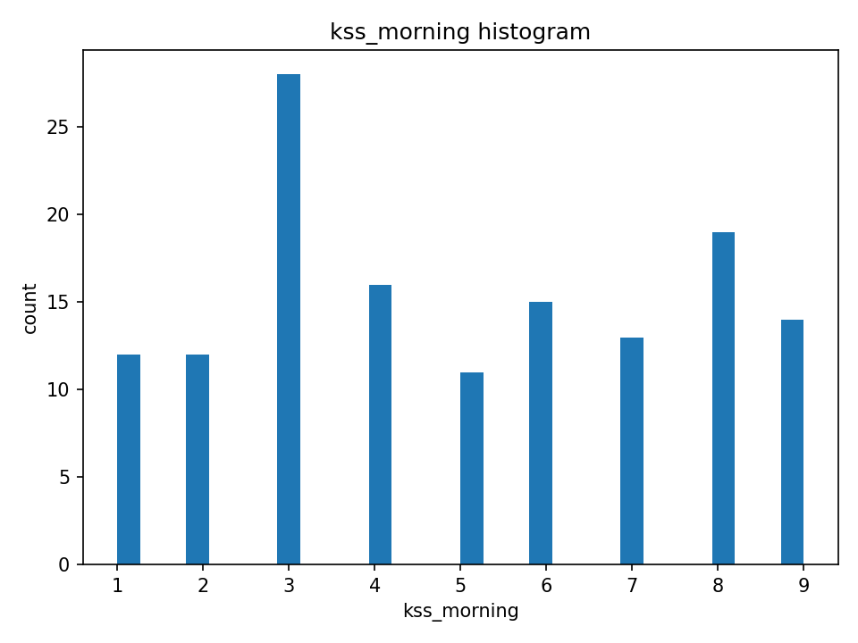

## 🧪 Auto Analysis Report

### baseline_cleaned_v7.csv

- Rows: **140**, Cols: **7**
- Numeric sample column: `kss_morning`
- 📊 Summary file: [baseline_cleaned_v7_summary.csv](baseline_cleaned_v7_summary.csv)
- 🖼️ Histogram:
  
  
